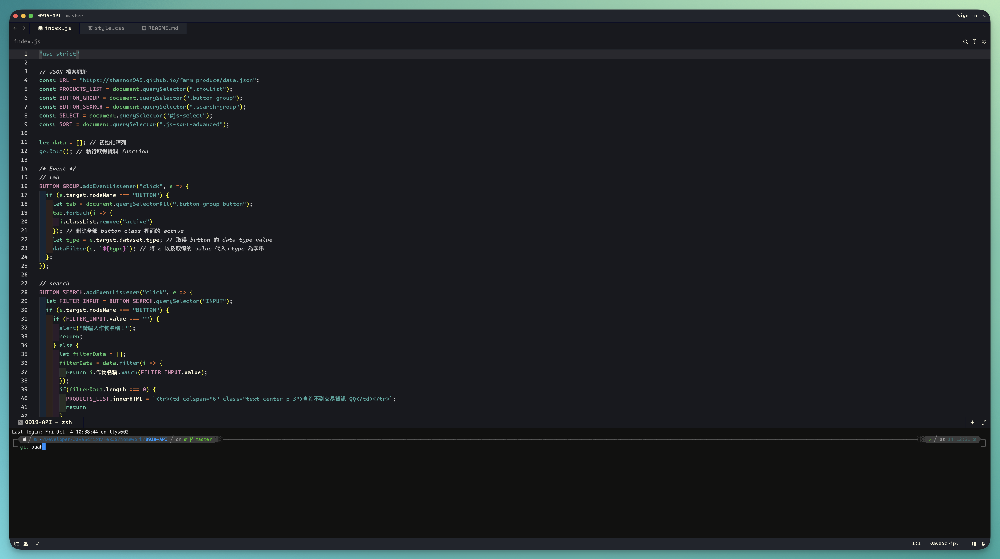

# Lighthaus theme

## 正體中文
- 參考了 [Lighthaus](https://github.com/lighthaus-theme) 製作的 [visual-studio-code](https://github.com/lighthaus-theme/visual-studio-code) 主題
- 這個主題同樣也基於 MIT licensed
- 礙於 Zed 目前可以設定的地方還有更多的進步空間，所以一些效果無法呈現（也可能是我沒有找到，如果有知道的人麻煩跟我說，或是發 PR，謝謝）

## English
- Referenced the [visual-studio-code](https://github.com/lighthaus-theme/visual-studio-code) theme created by [Lighthaus](https://github.com/lighthaus-theme)
- This theme is also based on the MIT license
- Due to Zed's current limitations in customization options, some effects cannot be implemented (or I may not have found how to do it; if anyone knows, please let me know or submit a PR, thank you)

## Journal

### 241010
- 修改 `editor.document_highlight.bracket_background` 為 `#8E8D8D`

### 241030
-  Changed:
  - "editor.document_highlight.bracket_background": "#8E8D8D", to "editor.document_highlight.bracket_background": null
  - "editor.active_line.background": null, to "editor.active_line.background": "#21252D"
  - "text.placeholder": null, to "text.placeholder": "#FFFF00"